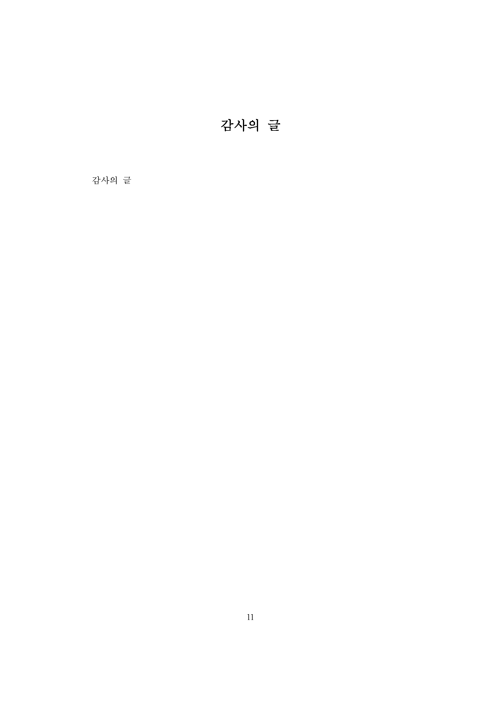

# EWHA_thesis_template
이화여자대학교 일반대학원 학위논문 LaTeX 템플릿 (비공식)

## 서식에 관하여
- 작성자: 송다은, Daeun Song (daeun7250@gmail.com)
- 2022-2 학기 박사 졸업 논문에 해당 제출 서식 사용하여 제출하였음
- **서울대학교 일반대학원 논문 서식**을 기반으로 이화여자대학교 제출 서식에 맞게 수정하여 작성되었음
- 영문 폰트는 *Times New Roman*, 한글 폰트는 *휴먼명조* 사용
- :warning: 정식 서식이 아니기 때문에 오류가 있을 수 있음
- :warning: 영문 양식만 작성되어 있음 (한글 양식X)
- :warning: 휴먼명조 폰트는 프로젝트에 직접 업로드 해야함 - **무단배포X**

## 미리보기
<table><tr><td>
    
</td></tr></table>
<table><tr><td>
    
</td></tr></table>
<table><tr><td>
    
</td></tr></table>
<table><tr><td>
    
</td></tr></table>
<table><tr><td>
    
</td></tr></table>
<table><tr><td>
    
</td></tr></table>
<table><tr><td>
    
</td></tr></table>
<table><tr><td>
    
</td></tr></table>
<table><tr><td>
    
</td></tr></table>
<table><tr><td>
    
</td></tr></table>

## 참고
- [notion README](https://daeunsong.notion.site/Ewha-Dissertation-Template-974f1e37bc094f968083fa19a5e2bd2d?pvs=4)
